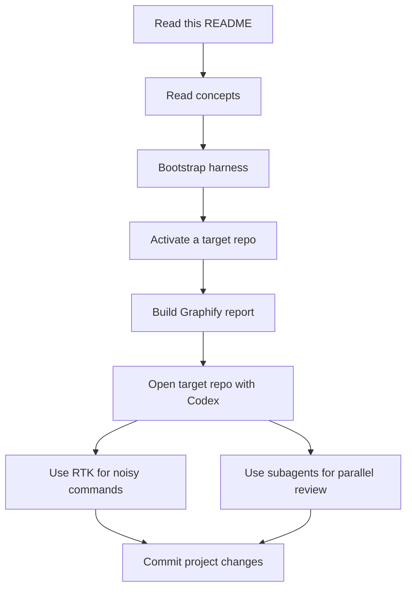

# Codex Harness

> A practical guide and reversible setup harness for working well with Codex, RTK, and Graphify across local repositories.

Codex Harness is both:

1. An installer that wires RTK and Graphify into a Codex-friendly workflow.
2. A beginner-friendly guide for using Codex CLI, the Codex app/cloud workflow, project instructions, subagents, and token-efficient repository understanding.

The goal is not to replace official Codex documentation. The goal is to give a working developer a repeatable setup, a rollback path, and concrete prompts they can copy into real projects.

## Contents

- [Who This Repo Is For](#who-this-repo-is-for)
- [What This Harness Installs](#what-this-harness-installs)
- [Start Here](#start-here)
- [Repository Layout](#repository-layout)
- [Codex Workflow Map](#codex-workflow-map)
- [RTK + Graphify Mental Model](#rtk--graphify-mental-model)
- [Useful Commands](#useful-commands)
- [Official References](#official-references)

## Who This Repo Is For

This repo is for people who want to:

| Need | Where to go |
| --- | --- |
| Install the harness safely | [Quickstart](docs/quickstart.md) |
| Understand what RTK and Graphify add | [Concepts](docs/concepts.md) and [RTK + Graphify](docs/rtk-graphify.md) |
| Use Codex CLI day to day | [Codex CLI Guide](docs/codex-cli.md) |
| Use the Codex app/cloud workflow | [Codex App and Cloud](docs/codex-app-cloud.md) |
| Configure Codex settings and instructions | [Settings](docs/settings.md) |
| Spawn useful subagents | [Prompt Examples](docs/prompts.md) |
| Roll back the harness | [Rollback Guide](docs/rollback.md) |

## What This Harness Installs

| Component | What it does |
| --- | --- |
| RTK | Wraps noisy commands such as `git`, `grep`, `find`, and tests so Codex sees compact, readable output. |
| Graphify | Builds repository maps under `graphify-out/` so Codex can start from a graph report instead of repeatedly scanning files. |
| Codex instructions | Adds reusable guidance in `AGENTS.md` and RTK docs so Codex knows when to use RTK and Graphify. |
| Rollback manifest | Records touched files and backups in `manifests/changes.json` and `state/backups/`. |

This harness can touch files outside this repo, especially `~/.codex/AGENTS.md`, `~/.codex/RTK.md`, `~/.codex/config.toml`, and activated project files. Read [Rollback](docs/rollback.md) before installing on a machine you care about.

## Start Here



Recommended reading path:

1. [Concepts](docs/concepts.md)
2. [Quickstart](docs/quickstart.md)
3. [Codex CLI](docs/codex-cli.md)
4. [Settings](docs/settings.md)
5. [RTK + Graphify](docs/rtk-graphify.md)
6. [Prompt Examples](docs/prompts.md)

## Repository Layout

| Path | Purpose |
| --- | --- |
| `README.md` | Project overview and command cookbook. |
| `scripts/harness.py` | Main bootstrap, activation, deactivation, and uninstall implementation. |
| `scripts/install.sh` | Bootstraps the harness on this machine. |
| `scripts/activate.sh` | Activates Graphify/Codex guidance for a target repo. |
| `scripts/build_graph.sh` | Builds a first Graphify report for a target repo. |
| `scripts/refresh_graph.sh` | Refreshes an existing Graphify report. |
| `scripts/deactivate.sh` | Restores files for one activated target repo. |
| `scripts/uninstall.sh` | Restores bootstrap files and removes harness-installed artifacts. |
| `templates/` | Instruction templates used by the harness and by humans reviewing behavior. |
| `docs/` | Beginner-friendly Codex, RTK, Graphify, subagent, and rollback guides. |
| `manifests/changes.json` | Machine-local record of harness-managed changes. |
| `vendor/` | RTK and Graphify source checkouts. |

## Codex Workflow Map

| Surface | Use it for |
| --- | --- |
| Codex CLI | Local terminal work, repo edits, command execution, tests, commits, and iterative debugging. |
| Codex app/cloud | Reviewing tasks, delegating repository work, PR-oriented workflows, and work you want tracked outside a local terminal. |
| `AGENTS.md` | Durable project instructions: commands, style, safety rules, and repo-specific workflow. |
| Subagents | Parallel, bounded review or implementation tasks when the user explicitly asks for them. |
| RTK | Lower-noise command output for Codex. |
| Graphify | High-signal repo maps before architecture or broad codebase questions. |

## RTK + Graphify Mental Model

Codex spends context on whatever you show it. Huge command output and repeated file scans waste that context.

RTK helps by making commands produce summarized, model-readable output. Graphify helps by giving Codex a repository map before it opens raw files.

Use this default pattern in activated repositories:

```bash
rtk git status
rtk git diff
rtk grep "function_or_setting"
rtk find . -type f
graphify update .
```

Then ask Codex to start from:

```text
Read graphify-out/GRAPH_REPORT.md first, then inspect only the files needed for this change.
```

## Useful Commands

### Install Harness

```bash
/home/trhova/codex_harness/scripts/install.sh
```

### Activate a Project

```bash
/home/trhova/codex_harness/scripts/activate.sh /path/to/project
```

### Build or Refresh a Graph

```bash
/home/trhova/codex_harness/scripts/build_graph.sh /path/to/project
/home/trhova/codex_harness/scripts/refresh_graph.sh /path/to/project
```

### Use RTK in a Repo

```bash
rtk git status
rtk git diff
rtk grep "TODO|FIXME"
rtk find . -type f
rtk pytest
```

### Deactivate One Project

```bash
/home/trhova/codex_harness/scripts/deactivate.sh /path/to/project
```

### Uninstall Everything the Harness Knows About

```bash
/home/trhova/codex_harness/scripts/uninstall.sh
```

### Example Subagent Prompt

```text
Use 4 subagents to review this repo. Do not edit files yet.

Agent 1: review documentation onboarding.
Agent 2: review installation and rollback safety.
Agent 3: review test and command ergonomics.
Agent 4: review token usage and Graphify/RTK guidance.

Each agent should return top findings, files involved, why it matters, proposed fix, and priority.
After all agents finish, merge duplicates and propose a ranked plan.
```

## Official References

Use these when documenting current Codex behavior:

- [Codex CLI](https://developers.openai.com/codex/cli)
- [Codex prompting](https://developers.openai.com/codex/prompting)
- [AGENTS.md guide](https://developers.openai.com/codex/guides/agents-md)
- [Codex config reference](https://developers.openai.com/codex/config-reference)
- [Codex subagents](https://developers.openai.com/codex/subagents)
- [Sandboxing](https://developers.openai.com/codex/concepts/sandboxing)
- [Approvals and security](https://developers.openai.com/codex/agent-approvals-security)

When official docs and this repo disagree, treat official docs as authoritative and update this repo.
