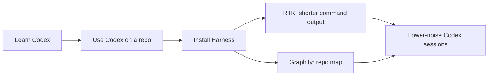

# Codex Harness

> A practical Codex handbook plus a reversible RTK + Graphify setup harness.

This repo has two jobs:

1. **Learn Codex:** what it is, how to use it, and what common words like skills, MCP, plugins, and subagents mean.
2. **Install the harness:** set up RTK and Graphify so Codex can inspect repositories with less noisy context and a clear rollback path.

This repo is written for people who want a clear operating model for Codex, from everyday use through a more structured RTK + Graphify setup.

## Safety First

Codex can read files, edit files, and run commands, so give it a safe workspace.

Good defaults:

- work inside a Git repository
- keep raw data, secrets, and irreplaceable files outside that repository
- commit or stash work before large changes
- use sandbox/approval settings while learning
- read approval prompts before allowing commands outside the project

On Windows, WSL2 is usually the easiest place to run terminal-based developer tools. Git helps because you can inspect diffs and roll back tracked files, but it is not a backup system.

## Start Here

| If you want to... | Read this first |
| --- | --- |
| Understand Codex concepts | [Learn Codex](#part-1-learn-codex) |
| Install RTK + Graphify | [Install the Harness](#part-2-install-the-harness) |
| Copy commands | [Useful Commands](#useful-commands) |
| Undo the setup | [Rollback Guide](docs/rollback.md) |



## Part 1: Learn Codex

Codex is a coding assistant that can act on a repository. You give it a task, and it can inspect files, edit code, run commands, explain choices, and help check whether the result works.

You do not need to learn every term before using it. Start with this loop:

1. Open a repository.
2. Explain the goal and constraints.
3. Let Codex inspect the code.
4. Review what it changes.
5. Run tests or checks.
6. Commit when the result is good.

| Concept | What it means in practice | When it makes sense | Guide |
| --- | --- | --- | --- |
| Codex CLI | Codex running in a terminal against files on your machine or remote shell. It can inspect the repo, edit files, run commands, and report what changed. | Use it for local development, focused repo edits, tests, refactors, documentation work, and iterative debugging. | [Codex CLI](docs/codex-cli.md) |
| Codex app/cloud | Codex running through an app or hosted task flow rather than only your local terminal. | Use it for longer-running tasks, PR-oriented work, or work you want to delegate and review outside an active shell session. | [Codex App and Cloud](docs/codex-app-cloud.md) |
| `AGENTS.md` | Repo instructions that Codex reads before working in that repository. The model should follow the commands, style rules, safety rules, and repo-specific workflow written there. | Use it when a repo has stable conventions: test commands, formatting rules, architecture notes, generated-file warnings, or instructions like “read Graphify first.” | [Settings](docs/settings.md) |
| Skills | Reusable instruction packs for tasks you want done the same way each time. A skill can include a `SKILL.md`, references, scripts, and templates. | Use skills for repeatable workflows that need precision: polishing a deck, reviewing a PR, creating a plugin, checking official OpenAI docs, or following a lab/team process. | [Concepts](docs/concepts.md) |
| MCP | Model Context Protocol: a way to connect Codex to external tools, data sources, or structured APIs through an MCP server. | Use MCP when Codex needs controlled access to something outside the repo, such as docs, browser automation, design files, databases, or internal systems. | [Concepts](docs/concepts.md) |
| Plugins | Bundles that can package skills, MCP setup, connectors, and app integrations. | Use plugins when a workflow needs several capabilities together, such as GitHub review tools plus related skills, or a team integration with its own commands and context. | [Concepts](docs/concepts.md) |
| Subagents | Additional agents that can work on separate, bounded tasks in parallel. | Use subagents for independent review or implementation slices: one agent checks docs, another checks scripts, another checks experiments. Keep write scopes separate. | [Prompt Examples](docs/prompts.md) |
| Approvals/sandboxing | Controls for what Codex can read, write, run, or access over the network. | Use stricter settings when exploring unfamiliar repos, protecting data, or letting Codex run commands you have not reviewed yet. | [Settings](docs/settings.md) |

### A Good First Prompt

```text
Read the README and explain how this repo is organized.
Do not edit files yet.
Tell me the safest first improvement to make.
```

## Part 2: Install the Harness

The harness exists for one main reason: **feed Codex less junk**.

Codex has limited useful context in each task. If it spends that context on huge file lists, raw logs, repeated `grep` output, vendored code, and broad scans, it has less room for the files and decisions that matter. RTK and Graphify help Codex start from compact summaries and a repository map, so it can spend fewer tokens getting oriented and more effort on the actual task.

Use the harness when you want Codex to inspect a repo with less noisy context, clearer structure, and a rollback path for the setup.

| Need | Where to go |
| --- | --- |
| Install the harness safely | [Quickstart](docs/quickstart.md) |
| Understand what RTK and Graphify add | [Concepts](docs/concepts.md) and [RTK + Graphify](docs/rtk-graphify.md) |
| Use Codex CLI day to day | [Codex CLI Guide](docs/codex-cli.md) |
| Use the Codex app/cloud workflow | [Codex App and Cloud](docs/codex-app-cloud.md) |
| Configure Codex settings and instructions | [Settings](docs/settings.md) |
| Spawn useful subagents | [Prompt Examples](docs/prompts.md) |
| Explore future RTK/Graphify-adjacent tools | [Tooling Roadmap](docs/tooling-roadmap.md) |
| Roll back the harness | [Rollback Guide](docs/rollback.md) |

### What This Harness Installs

| Component | Scope | What it does |
| --- | --- | --- |
| RTK binary | Global for your shell after install | Adds `rtk` to your PATH so any repo can use compact command summaries. |
| Graphify Python environment | Harness-local install | Installs Graphify inside this repo's `.venv`; the wrapper scripts use that environment to build or refresh graphs. |
| Global Codex guidance | Global Codex config area | Can update files under `~/.codex/`, such as `AGENTS.md`, `RTK.md`, and `config.toml`, so Codex knows RTK/Graphify exist. |
| Project activation | Per target repository | Adds or updates repo-specific Codex/Graphify files such as `AGENTS.md`, `.codex/hooks.json`, and `graphify-out/` in the project you activate. |
| Rollback manifest | Harness-local state | Records touched files and backups in `manifests/changes.json` and `state/backups/`. |

The installer is not purely project-local. `install.sh` prepares global shell/Codex support, while `activate.sh /path/to/project` applies project-specific guidance to one target repo. Read [Rollback](docs/rollback.md) before installing on a machine you care about.

Recommended harness reading path:

1. [Concepts](docs/concepts.md)
2. [Quickstart](docs/quickstart.md)
3. [Codex CLI](docs/codex-cli.md)
4. [Settings](docs/settings.md)
5. [RTK + Graphify](docs/rtk-graphify.md)
6. [Prompt Examples](docs/prompts.md)

## Repository Layout

| Path | Purpose |
| --- | --- |
| `README.md` | Project overview and command cookbook. |
| `scripts/harness.py` | Main bootstrap, activation, deactivation, and uninstall implementation. |
| `scripts/install.sh` | Bootstraps the harness on this machine. |
| `scripts/activate.sh` | Activates Graphify/Codex guidance for a target repo. |
| `scripts/build_graph.sh` | Builds a first Graphify report for a target repo. |
| `scripts/refresh_graph.sh` | Refreshes an existing Graphify report. |
| `scripts/deactivate.sh` | Restores files for one activated target repo. |
| `scripts/uninstall.sh` | Restores bootstrap files and removes harness-installed artifacts. |
| `templates/` | Instruction templates used by the harness and by humans reviewing behavior. |
| `docs/` | Practical Codex, RTK, Graphify, subagent, and rollback guides. |
| `manifests/changes.json` | Machine-local record of harness-managed changes. |
| `vendor/` | RTK and Graphify source checkouts. |

## Codex Workflow Map

| Surface | Use it for |
| --- | --- |
| Codex CLI | Local terminal work, repo edits, command execution, tests, commits, and iterative debugging. |
| Codex app/cloud | Reviewing tasks, delegating repository work, PR-oriented workflows, and work you want tracked outside a local terminal. |
| `AGENTS.md` | Durable project instructions: commands, style, safety rules, and repo-specific workflow. |
| Subagents | Parallel, bounded review or implementation tasks when the user explicitly asks for them. |
| RTK | Lower-noise command output for Codex. |
| Graphify | High-signal repo maps before architecture or broad codebase questions. |

## RTK + Graphify Mental Model

Codex has a limited working memory for each task. Huge command output and repeated file scans use that memory quickly.

RTK helps by making command output shorter. Graphify helps by giving Codex a map of the repository before it opens raw files.

Use this default pattern in activated repositories:

```bash
rtk git status
rtk git diff
rtk grep "function_or_setting"
rtk find . -type f
/home/<user>/codex_harness/scripts/refresh_graph.sh /path/to/project
```

Then ask Codex to start from:

```text
Read graphify-out/GRAPH_REPORT.md first, then inspect only the files needed for this change.
```

## Measured Context Reduction

We tested the harness idea with a reproducible experiment in [experiments/context_size](experiments/context_size/README.md). The question was simple: if Codex starts from compact summaries and a repository map, how much less text does it need to read before it knows where to work?

Four independent work streams created small fixture repositories across frontend/3D, backend, ops/HPC, and docs-heavy tasks. For each fixture, the script generates two text transcripts:

| Workflow | What it simulates |
| --- | --- |
| Without harness | A naive first pass: list many files, search broadly, and read full text. |
| With harness | A guided first pass: compact command summaries plus a repository-structure report. |

The experiment counts actual transcript tokens with `tiktoken` using the `o200k_base` tokenizer. It does not use private Codex telemetry and it does not measure billing tokens, accuracy, or elapsed time. It measures the amount of text a Codex-like model would need to read in this controlled first-pass workflow.


Across 14 fixtures, the harness-style transcript reduced measured tokens from 27,541 to 10,254 total tokens: **62.8% fewer measured transcript tokens overall**. In the chart, each family label uses a **pooled family reduction**: `1 - sum(harness_tokens) / sum(baseline_tokens)` across that family. That is not the plain mean of the replicate percentages; larger fixtures contribute proportionally more. Pooled family reductions range from **26.5%** on documentation-heavy fixtures to **74.8%** on frontend/3D fixtures, while individual replicate reductions range from **23.6%** to **78.5%**.

Experiment design:

- 14 fixtures across five families: frontend/3D, backend/data, ops/HPC, docs-heavy, and original smoke fixtures.
- Frontend, backend, and ops fixtures were generated by separate agents with different task briefs; docs-heavy fixtures were added separately as a lower-code comparison group.
- Each fixture defines a `scenario.json` search pattern, so the search task is explicit and reproducible.
- The baseline transcript simulates broad manual exploration.
- The harness transcript simulates a more disciplined workflow: summarize first, map structure second, open raw files later.

Reproduce it:

```bash
cd /home/<user>/codex_harness
python3 -m pip install -r experiments/context_size/requirements.txt
python3 experiments/context_size/run_experiment.py
```

The chart is generated at [experiments/context_size/results/context_reduction_by_family.svg](experiments/context_size/results/context_reduction_by_family.svg), and the full results are in [summary.csv](experiments/context_size/results/summary.csv). Treat this as evidence that the workflow can reduce context size, not as a universal guarantee. Real Codex savings depend on the task, prompt, repo size, and whether the agent still needs raw logs or full files.

## Useful Commands

### Install Harness

```bash
/home/<user>/codex_harness/scripts/install.sh
```

### Activate a Project

```bash
/home/<user>/codex_harness/scripts/activate.sh /path/to/project
```

### Build or Refresh a Graph

```bash
/home/<user>/codex_harness/scripts/build_graph.sh /path/to/project
/home/<user>/codex_harness/scripts/refresh_graph.sh /path/to/project
```

### Use RTK in a Repo

```bash
rtk git status
rtk git diff
rtk grep "TODO|FIXME"
rtk find . -type f
rtk pytest
```

### Deactivate One Project

```bash
/home/<user>/codex_harness/scripts/deactivate.sh /path/to/project
```

### Uninstall Everything the Harness Knows About

```bash
/home/<user>/codex_harness/scripts/uninstall.sh
```

### Example Subagent Prompt

```text
Use 4 subagents to review this repo. Do not edit files yet.

Agent 1: review documentation onboarding.
Agent 2: review installation and rollback safety.
Agent 3: review test and command ergonomics.
Agent 4: review token usage and Graphify/RTK guidance.

Each agent should return top findings, files involved, why it matters, proposed fix, and priority.
After all agents finish, merge duplicates and propose a ranked plan.
```

## Official References

Use these when documenting current Codex behavior:

- [Codex CLI](https://developers.openai.com/codex/cli)
- [Codex prompting](https://developers.openai.com/codex/prompting)
- [AGENTS.md guide](https://developers.openai.com/codex/guides/agents-md)
- [Codex config reference](https://developers.openai.com/codex/config-reference)
- [Codex subagents](https://developers.openai.com/codex/subagents)
- [Sandboxing](https://developers.openai.com/codex/concepts/sandboxing)
- [Approvals and security](https://developers.openai.com/codex/agent-approvals-security)

When official docs and this repo disagree, treat official docs as authoritative and update this repo.
