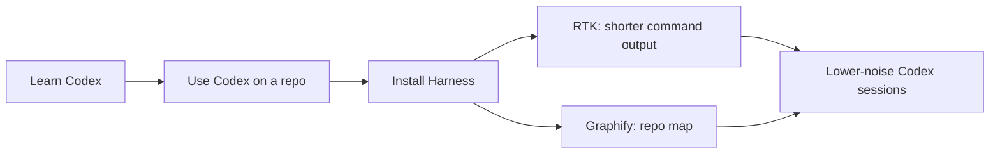
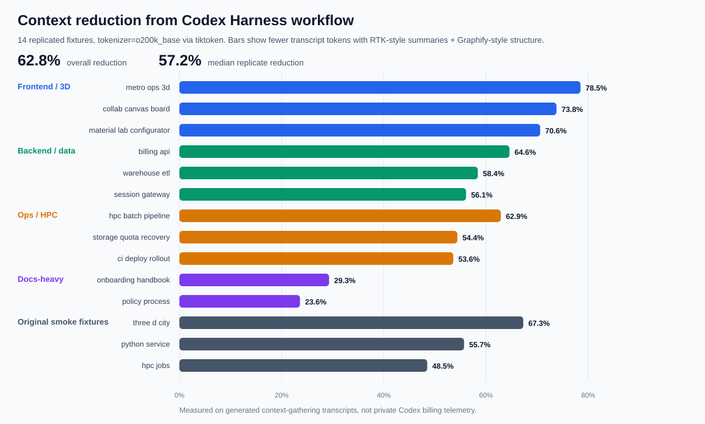

# Codex Harness

> A beginner-friendly Codex handbook plus a reversible RTK + Graphify setup harness.

This repo has two jobs:

1. **Learn Codex:** what it is, how to use it, and what common words like skills, MCP, plugins, and subagents mean.
2. **Install the harness:** set up RTK and Graphify so Codex can inspect repositories with less noisy context and a clear rollback path.

This repo is written for people who may be comfortable using a computer but are still new to developer tools, terminals, configuration files, or AI agent vocabulary.

## Safety First

Codex is useful because it can read files, edit files, and run commands for you. Those same abilities mean you should give it a safe place to work.

If you are new, the most practical default is usually:

- work inside a Git repository
- keep raw, private, or irreplaceable data outside that repository
- commit or stash work before large changes
- start with normal sandbox/approval settings
- read approval prompts before allowing commands that write outside the project

On Windows, WSL2 is often the easiest and safest way to use terminal-based developer tools. It gives you a Linux environment with a clearer boundary than running everything directly in your personal Windows folders. It is not magic protection, but it makes the workflow closer to what most developer tooling expects.

Git reduces risk because you can inspect diffs and roll back tracked code. It does not protect files that are not tracked, and it does not replace backups. There is always a small risk that any automation, including an AI agent, can damage files if it is pointed at the wrong directory or given too much permission. The balance we want is practical: let Codex help with code and docs, but do not put the only copy of raw data, credentials, or important personal files in its work area.

## Start Here

| If you want to... | Read this first |
| --- | --- |
| Understand Codex from scratch | [Learn Codex](#part-1-learn-codex) |
| Install RTK + Graphify | [Install the Harness](#part-2-install-the-harness) |
| Copy commands | [Useful Commands](#useful-commands) |
| Undo the setup | [Rollback Guide](docs/rollback.md) |



## Part 1: Learn Codex

Codex is a coding assistant that can act on a repository. You give it a task, and it can inspect files, edit code, run commands, explain choices, and help check whether the result works.

You do not need to learn every term before using it. Start with this loop:

1. Open a repository.
2. Explain the goal and constraints.
3. Let Codex inspect the code.
4. Review what it changes.
5. Run tests or checks.
6. Commit when the result is good.

| Beginner topic | Plain meaning | Guide |
| --- | --- | --- |
| Codex CLI | Codex running in a terminal on your machine. | [Codex CLI](docs/codex-cli.md) |
| Codex app/cloud | Codex working through an app or remote task flow. | [Codex App and Cloud](docs/codex-app-cloud.md) |
| `AGENTS.md` | A note that tells Codex how this repo should be handled. | [Settings](docs/settings.md) |
| Skills | Reusable instructions for repeatable work. | [Concepts](docs/concepts.md) |
| MCP | A way to connect Codex to extra tools and data sources. | [Concepts](docs/concepts.md) |
| Plugins | Bundled integrations that may provide skills, tools, or connectors. | [Concepts](docs/concepts.md) |
| Subagents | Extra agents that can work on separate tasks in parallel. | [Prompt Examples](docs/prompts.md) |
| Approvals/sandboxing | Safety controls for commands, files, and network access. | [Settings](docs/settings.md) |

### A Good First Prompt

```text
Read the README and explain how this repo is organized.
Do not edit files yet.
Tell me the safest first improvement to make.
```

### A Good Implementation Prompt

```text
Implement the approved README improvement.
Before editing, list the files you will change.
After editing, summarize the diff and commands run.
Do not include secrets or private paths.
```

## Part 2: Install the Harness

The harness part is for people who want Codex to spend less time reading noisy command output and repeatedly scanning the same files.

| Need | Where to go |
| --- | --- |
| Install the harness safely | [Quickstart](docs/quickstart.md) |
| Understand what RTK and Graphify add | [Concepts](docs/concepts.md) and [RTK + Graphify](docs/rtk-graphify.md) |
| Use Codex CLI day to day | [Codex CLI Guide](docs/codex-cli.md) |
| Use the Codex app/cloud workflow | [Codex App and Cloud](docs/codex-app-cloud.md) |
| Configure Codex settings and instructions | [Settings](docs/settings.md) |
| Spawn useful subagents | [Prompt Examples](docs/prompts.md) |
| Explore future RTK/Graphify-adjacent tools | [Tooling Roadmap](docs/tooling-roadmap.md) |
| Roll back the harness | [Rollback Guide](docs/rollback.md) |

### What This Harness Installs

| Component | What it does |
| --- | --- |
| RTK | Makes noisy command output shorter and easier for Codex to read. |
| Graphify | Builds a repository map so Codex can start from structure instead of guessing where to look. |
| Codex instructions | Adds reusable guidance in `AGENTS.md` and RTK docs so Codex knows when to use RTK and Graphify. |
| Rollback manifest | Records touched files and backups in `manifests/changes.json` and `state/backups/`. |

This harness can touch files outside this repo, especially `~/.codex/AGENTS.md`, `~/.codex/RTK.md`, `~/.codex/config.toml`, and activated project files. Read [Rollback](docs/rollback.md) before installing on a machine you care about.

Recommended harness reading path:

1. [Concepts](docs/concepts.md)
2. [Quickstart](docs/quickstart.md)
3. [Codex CLI](docs/codex-cli.md)
4. [Settings](docs/settings.md)
5. [RTK + Graphify](docs/rtk-graphify.md)
6. [Prompt Examples](docs/prompts.md)

## Repository Layout

| Path | Purpose |
| --- | --- |
| `README.md` | Project overview and command cookbook. |
| `scripts/harness.py` | Main bootstrap, activation, deactivation, and uninstall implementation. |
| `scripts/install.sh` | Bootstraps the harness on this machine. |
| `scripts/activate.sh` | Activates Graphify/Codex guidance for a target repo. |
| `scripts/build_graph.sh` | Builds a first Graphify report for a target repo. |
| `scripts/refresh_graph.sh` | Refreshes an existing Graphify report. |
| `scripts/deactivate.sh` | Restores files for one activated target repo. |
| `scripts/uninstall.sh` | Restores bootstrap files and removes harness-installed artifacts. |
| `templates/` | Instruction templates used by the harness and by humans reviewing behavior. |
| `docs/` | Beginner-friendly Codex, RTK, Graphify, subagent, and rollback guides. |
| `manifests/changes.json` | Machine-local record of harness-managed changes. |
| `vendor/` | RTK and Graphify source checkouts. |

## Codex Workflow Map

| Surface | Use it for |
| --- | --- |
| Codex CLI | Local terminal work, repo edits, command execution, tests, commits, and iterative debugging. |
| Codex app/cloud | Reviewing tasks, delegating repository work, PR-oriented workflows, and work you want tracked outside a local terminal. |
| `AGENTS.md` | Durable project instructions: commands, style, safety rules, and repo-specific workflow. |
| Subagents | Parallel, bounded review or implementation tasks when the user explicitly asks for them. |
| RTK | Lower-noise command output for Codex. |
| Graphify | High-signal repo maps before architecture or broad codebase questions. |

## RTK + Graphify Mental Model

Codex has a limited working memory for each task. Huge command output and repeated file scans use that memory quickly.

RTK helps by making command output shorter. Graphify helps by giving Codex a map of the repository before it opens raw files.

Use this default pattern in activated repositories:

```bash
rtk git status
rtk git diff
rtk grep "function_or_setting"
rtk find . -type f
/home/<user>/codex_harness/scripts/refresh_graph.sh /path/to/project
```

Then ask Codex to start from:

```text
Read graphify-out/GRAPH_REPORT.md first, then inspect only the files needed for this change.
```

## Measured Context Reduction

We tested the harness idea with a reproducible experiment in [experiments/context_size](experiments/context_size/README.md). The question was simple: if Codex starts from compact summaries and a repository map, how much less text does it need to read before it knows where to work?

Four independent work streams created small fixture repositories across frontend/3D, backend, ops/HPC, and docs-heavy tasks. For each fixture, the script generates two text transcripts:

| Workflow | What it simulates |
| --- | --- |
| Without harness | A naive first pass: list many files, search broadly, and read full text. |
| With harness | A guided first pass: compact command summaries plus a repository-structure report. |

The experiment counts actual transcript tokens with `tiktoken` using the `o200k_base` tokenizer. It does not use private Codex telemetry and it does not measure billing tokens, accuracy, or elapsed time. It measures the amount of text a Codex-like model would need to read in this controlled first-pass workflow.



Across 14 fixtures, the harness-style transcript reduced measured tokens from 27,541 to 10,254 total tokens: **62.8% fewer measured transcript tokens overall**. The median per-fixture reduction was **57.2%**, with a range from **23.6%** on documentation-heavy fixtures to **78.5%** on the largest frontend/3D fixture.

Experiment design:

- 14 fixtures across five families: frontend/3D, backend/data, ops/HPC, docs-heavy, and original smoke fixtures.
- Frontend, backend, and ops fixtures were generated by separate agents with different task briefs; docs-heavy fixtures were added separately as a lower-code comparison group.
- Each fixture defines a `scenario.json` search pattern, so the search task is explicit and reproducible.
- The baseline transcript simulates broad manual exploration.
- The harness transcript simulates a more disciplined workflow: summarize first, map structure second, open raw files later.

Reproduce it:

```bash
cd /home/<user>/codex_harness
python3 -m pip install -r experiments/context_size/requirements.txt
python3 experiments/context_size/run_experiment.py
```

The chart is generated at [experiments/context_size/results/context_reduction_by_family.svg](experiments/context_size/results/context_reduction_by_family.svg), and the full results are in [summary.csv](experiments/context_size/results/summary.csv). Treat this as evidence that the workflow can reduce context size, not as a universal guarantee. Real Codex savings depend on the task, prompt, repo size, and whether the agent still needs raw logs or full files.

## Useful Commands

### Install Harness

```bash
/home/trhova/codex_harness/scripts/install.sh
```

### Activate a Project

```bash
/home/trhova/codex_harness/scripts/activate.sh /path/to/project
```

### Build or Refresh a Graph

```bash
/home/trhova/codex_harness/scripts/build_graph.sh /path/to/project
/home/trhova/codex_harness/scripts/refresh_graph.sh /path/to/project
```

### Use RTK in a Repo

```bash
rtk git status
rtk git diff
rtk grep "TODO|FIXME"
rtk find . -type f
rtk pytest
```

### Deactivate One Project

```bash
/home/trhova/codex_harness/scripts/deactivate.sh /path/to/project
```

### Uninstall Everything the Harness Knows About

```bash
/home/trhova/codex_harness/scripts/uninstall.sh
```

### Example Subagent Prompt

```text
Use 4 subagents to review this repo. Do not edit files yet.

Agent 1: review documentation onboarding.
Agent 2: review installation and rollback safety.
Agent 3: review test and command ergonomics.
Agent 4: review token usage and Graphify/RTK guidance.

Each agent should return top findings, files involved, why it matters, proposed fix, and priority.
After all agents finish, merge duplicates and propose a ranked plan.
```

## Official References

Use these when documenting current Codex behavior:

- [Codex CLI](https://developers.openai.com/codex/cli)
- [Codex prompting](https://developers.openai.com/codex/prompting)
- [AGENTS.md guide](https://developers.openai.com/codex/guides/agents-md)
- [Codex config reference](https://developers.openai.com/codex/config-reference)
- [Codex subagents](https://developers.openai.com/codex/subagents)
- [Sandboxing](https://developers.openai.com/codex/concepts/sandboxing)
- [Approvals and security](https://developers.openai.com/codex/agent-approvals-security)

When official docs and this repo disagree, treat official docs as authoritative and update this repo.
